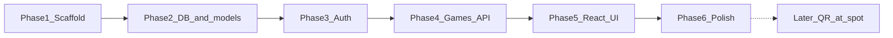

# Soccer pickup game organizer (learning plan)

## Why this stack

You already have partial overlap with each layer: **React + Tailwind** for UI, **FastAPI** for APIs, **PostgreSQL** for data. That trio is a common “small real app” shape and maps cleanly to tutorials and docs.

- **Frontend**: [Vite](https://vitejs.dev/) + React + Tailwind — fast dev server, good errors for beginners.
- **Backend**: FastAPI — automatic OpenAPI docs at `/docs` so you can try endpoints before the UI exists.
- **Database**: PostgreSQL running locally via **Docker Compose** (one command to start DB; you learn SQL and migrations in a realistic setup).

Keep **Java/C++** out of this project so you focus on one web stack.

## What you build in order (phased)




| Phase                    | Goal                                                              | What you learn                                              |
| ------------------------ | ----------------------------------------------------------------- | ----------------------------------------------------------- |
| **1 – Scaffold**         | Two folders: `backend/`, `frontend/`; README with “how to run”    | Project layout, env vars, running two terminals             |
| **2 – DB & models**      | Tables: `users`, `games`, `game_players` (who joined)             | SQLAlchemy models, Alembic migrations, relationships        |
| **3 – Auth**             | Register, login, JWT in `Authorization` header                    | Password hashing (e.g. bcrypt), tokens, protected routes    |
| **4 – Games API**        | CRUD games; join/leave; list attendees; enforce max players       | HTTP design, validation, transactions                       |
| **5 – React UI**         | Pages: register/login, game list, create game, game detail + join | `fetch` or axios, forms, React Router, loading/error states |
| **6 – Polish**           | Validation messages, empty states, basic styling                  | UX habits that make an app feel “real”                      |
| **Later – QR / at spot** | QR encodes URL to game page; optional “quick join” flow           | Deferred until Phase 6 feels solid                          |


**QR / join at the spot** (your idea): Technically it is “a link to one game” + maybe a short “I’m here” button after login. No need for native mobile at first—phone browser opens the link. Park that after accounts + join flow work end-to-end.

## Suggested domain model (minimal)

- **User**: email (unique), hashed password, display name.
- **Game**: organizer (`user_id`), title, `starts_at`, location (text), `max_players`, optional description.
- **GamePlayer**: `game_id` + `user_id` (unique together), `joined_at` — represents “RSVP / spot taken”.

Business rules: cannot join if full; cannot join twice; only authenticated users (MVP).

## Repository layout (to create from scratch)

```
Pickup/
  docker-compose.yml          # postgres service only
  backend/
    app/
      main.py                 # FastAPI app, CORS for localhost:5173
      models.py
      schemas.py              # Pydantic request/response
      routers/                # auth.py, games.py
      deps.py                 # get_current_user, get_db
    alembic/                  # migrations
    requirements.txt
  frontend/
    src/
      pages/ ...
      api/ ...                # small wrapper around fetch + token
    ...
```

CORS: allow `http://localhost:5173` (Vite default) to call `http://localhost:8000`.

## Local run (target experience)

1. `docker compose up -d` → Postgres.
2. Backend: migrate DB, `uvicorn` on port 8000.
3. Frontend: `npm run dev` on port 5173.

No cloud deploy in this plan; you can add free hosting later without changing the core design much.

## Beginner pitfalls to expect (so they do not surprise you)

- **CORS errors**: almost always fixed by backend CORS + correct API URL in frontend.
- **Token storage**: start with `localStorage` for the JWT; learn refresh tokens later if needed.
- **Time zones**: store `starts_at` in UTC in the DB; show local time in the UI (small but important).

## Stretch goals (only after MVP)

- Email reminders (needs a provider; skip early).
- Maps link from address (just a Google Maps URL is enough).
- Recurring games (harder; defer).

## Success criteria for “MVP done”

You can register, log in, create a game, see it in a list, open it, join/leave, see other players, and hitting max players blocks new joins—all **locally**.